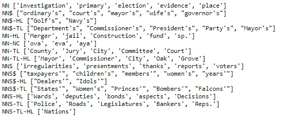

# Part-Of-Speech-tagging

Part-Of-Speech-tagging using Hidden Markov model to identify the category of words ('noun', 'verb', ...) in plain text.

# Description

This project is part of Udacity [Natural Language Processing Nanodegree](https://www.udacity.com/course/natural-language-processing-nanodegree--nd892).

The objective is to categorize each word in sentences as one of the 12 categories of the universal POS tag set. This process is called Part-Of-Speech-Tagging.

Part of speech tagging is the process of determining the syntactic category of a word from the words in its surrounding context. Parts of speech (also known as POS, word classes, or syntactic categories) are useful because they reveal a lot about a word and its neighbors. Knowing whether a word is a noun or a verb tells us about likely neighboring words (nouns are preceded by determiners and adjectives, verbs by nouns) and syntactic structure (nouns are generally part of noun phrases), making part-of-speech tagging a key aspect of parsing. It is often used to help disambiguate natural language phrases because it can be done quickly with high accuracy. Tagging can be used for many NLP tasks like determining correct pronunciation during speech synthesis (for example, the word content is pronounced CONtent when it is a noun and conTENT when it is an adjective, same with dis-count as a noun vs dis-count as a verb), for information retrieval, for labeling named entities like people or organizations in information extraction and for word sense disambiguation.

The universal POS tagset used in this project defines the following twelve POS tags: NOUN (nouns), VERB (verbs), ADJ (adjectives), ADV (adverbs), PRON (pronouns), DET (determiners and articles), ADP (prepositions and postpositions), NUM (numerals), CONJ (conjunctions), PRT (particles), ‘.’ (punctuation marks) and X (a catch-all for other categories such as abbreviations or foreign words). For more details, you can check out this [paper](http://www.petrovi.de/data/universal.pdf).

At the end of the project, the unsimplied tagset which includes multiple variants is used on the full Brown Corpus.

# Dataset used

The project uses [Brown corpus dataset](https://en.wikipedia.org/wiki/Brown_Corpus). The Brown University Standard Corpus of Present-Day American English (or just Brown Corpus) is an electronic collection of text samples of American English, the first major structured corpus of varied genres. This corpus first set the bar for the scientific study of the frequency and distribution of word categories in everyday language use. The Brown Corpus consists of 500 samples, distributed across 15 genres in rough proportion to the amount published in 1961 in each of those genres. All works sampled were published in 1961; as far as could be determined they were first published then, and were written by native speakers of American English. The corpus originally contained 1,014,312 words sampled from 15 text categories (Press, fiction, ...). There are 57,340 sentences in the corpus.

# Hidden Markov Model and Viterbi algorithm

In such POS tagging task, we have observable values represented by the sentences and their words. And we have hidden states represented by the tags such as 'noun', 'verb', 'adjective', 'pronoun', etc... which we want to attach to each word. The input to the tagging algorithm is a sequence of (tokenized) words and a tagset, and the output is a sequence of tags, one per token.

Hidden Markov models have been able to achieve >96% tag accuracy with larger tagsets on realistic text corpora. Hidden Markov models have also been used for speech recognition and speech generation, machine translation, gene recognition for bioinformatics, and human gesture recognition for computer vision, and more.

An HMM is a probabilistic sequence model: given a sequence of units (words, letters, morphemes, sentences, whatever), it computes a probability distribution over possible sequences of labels and chooses the best label sequence. 𝜆=(𝐴,𝐵) specifies a Hidden Markov Model in terms of a state transition probability distribution 𝐴 and an emission probability distribution 𝐵. HMM specific components are:
 - a set of N states (the tag set here)
 - a transition probability matrix A, each Aij representing the probability of moving from state i to state j
 - a sequence of emission probabilities B, each expressing the probability of an observation (a word) being associated to one of the states (tag)
 - an initial probability distribution over states, ie indicating the probability that the Markov chain will start in state i
 
Bayes' rule on conditional probabilities is key to compute these probability distributions based on labeled training data. Indeed, HMM networks are parameterized by these two distributions: the emission probabilities giving the conditional probability of observing evidence values for each hidden state, and the transition probabilities giving the conditional probability of moving between states during the sequence. Additionally, you can specify an initial distribution describing the probability of a sequence starting in each state.

Using a transition graph, the POS selected is the one with the highest probability, ie maximum likelihood. This is achieved using Viterbi algorithm, the decoding algorithm for HMMs. This is called "decoding" because we use the observation sequence to decode the corresponding hidden state sequence. In the part of speech tagging problem, the hidden states map to parts of speech and the observations map to sentences. Given a sentence, Viterbi decoding finds the most likely sequence of part of speech tags corresponding to the sentence.

Below, a sketch showing the possible tags for each word and highlighting the path corresponding to the correct tag sequence through the hidden states. The Viterbi algorithm calculates the single path with the highest likelihood to produce a specific observation sequence.

States (parts of speech) which have a zero probability of generating a particular word according to the emission B matrix (such as the probability that a determiner DT will be realized as Janet) are greyed out.

# Dependencies

The project uses the [Pomegranate](https://github.com/jmschrei/pomegranate) library to build a hidden Markov model for part of speech tagging.

# Results

Two models using the Universal POS tagset are compared first:

- The simplest tagger (and a good baseline for tagger performance) is to simply choose the tag most frequently assigned to each word. This "most frequent class" tagger inspects each observed word in the sequence and assigns it the label that was most often assigned to that word in the corpus. The performance achieved is already excellent. The accuracy is shown below.

- Hidden Markov Model using bigrams. The performance of this model improves by a few percentage points compared to the base line represented by the simplest MFC tagger which simply chooses the tag most frequently assigned to each word. The performance achieved is above 95% accuracy on the unseen test set. 

Model mapping:

The full Brown Corpus is then used with the unsimplied tagset. There are many variants of tagsets increasing complexity significantly. For example, looking at Nouns or NN tagset variants, the most important contain $ for possessive nouns, S for plural nouns (since plural nouns typically end in s) and P for proper nouns. In addition, most of the tags have suffix modifiers: -NC for citations, -HL for words in headlines and -TL for titles (a feature of Brown tabs).

I counted over 450 tagsets in the train dataset. A function is provided in the notebook to explore the various tagset and get some examples of words for the variants.

Depending on the context, a word can take different tags as illustrated below. The complexity becomes very significant.

A model is fit on the large corpus with the unsimplied tagset. Accuracy reached is just over 92% on the unseen test set.
Laplace smoothing is then applied. This technique improve the baseline model for 1% in absolute and achieve nearly 94% tag accuracy.

Decoding with errors:

