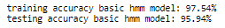

# Part-Of-Speech-tagging

Part-Of-Speech-tagging using Hidden Markov model to identify the category of words ('noun', 'verb', ...) in plain text.

# Description

This project is part of Udacity [Natural Language Processing Nanodegree](https://www.udacity.com/course/natural-language-processing-nanodegree--nd892).

The objective is to categorize each word in sentences as one of the 12 categories of the universal POS tag set. This process is called Part-Of-Speech-Tagging.

Part of speech tagging is the process of determining the syntactic category of a word from the words in its surrounding context. It is often used to help disambiguate natural language phrases because it can be done quickly with high accuracy. Tagging can be used for many NLP tasks like determining correct pronunciation during speech synthesis (for example, dis-count as a noun vs dis-count as a verb), for information retrieval, and for word sense disambiguation.

The universal POS tagset used defines the following twelve POS tags: NOUN (nouns), VERB (verbs), ADJ (adjectives), ADV (adverbs), PRON (pronouns), DET (determiners and articles), ADP (prepositions and postpositions), NUM (numerals), CONJ (conjunctions), PRT (particles), ‘.’ (punctuation marks) and X (a catch-all for other categories such as abbreviations or foreign words). For more details, you can check out this [paper](http://www.petrovi.de/data/universal.pdf).

# Dataset used

The project uses Brown corpus dataset. The Brown University Standard Corpus of Present-Day American English (or just Brown Corpus) is an electronic collection of text samples of American English, the first major structured corpus of varied genres. This corpus first set the bar for the scientific study of the frequency and distribution of word categories in everyday language use. The Brown Corpus consists of 500 samples, distributed across 15 genres in rough proportion to the amount published in 1961 in each of those genres. All works sampled were published in 1961; as far as could be determined they were first published then, and were written by native speakers of American English. The corpus originally contained 1,014,312 words sampled from 15 text categories (Press, fiction, ...). There are 57,340 sentences in the corpus.

# Hidden Markov Model and Viterbi algorithm

In such POS tagging tack, we have observable values represented by the sentences and their words. And we have hidden states represented by the tags such as 'noun', 'verb', 'adjective', 'pronoun', etc... which we want to attach to each word. 

Hidden Markov models have been able to achieve >96% tag accuracy with larger tagsets on realistic text corpora. Hidden Markov models have also been used for speech recognition and speech generation, machine translation, gene recognition for bioinformatics, and human gesture recognition for computer vision, and more.

𝜆=(𝐴,𝐵) specifies a Hidden Markov Model in terms of an emission probability distribution 𝐴 and a state transition probability distribution 𝐵. Bayes' rule on conditional probabilities is key to compute these probability distributions based on labeled training data. HMM networks are parameterized by two distributions: the emission probabilities giving the conditional probability of observing evidence values for each hidden state, and the transition probabilities giving the conditional probability of moving between states during the sequence. Additionally, you can specify an initial distribution describing the probability of a sequence starting in each state.

Using a transition graph, the POS selected is the one with the highest probability, ie maximum likelihood. This is achieved using Viterbi algorithm.

# Dependencies

The project uses the [Pomegranate](https://github.com/jmschrei/pomegranate) library to build a hidden Markov model for part of speech tagging.

# Results

Two models are compared:
- The simplest tagger (and a good baseline for tagger performance) is to simply choose the tag most frequently assigned to each word. This "most frequent class" tagger inspects each observed word in the sequence and assigns it the label that was most often assigned to that word in the corpus. The performance achieved is already excellent. The accuracy is shown below.

- Hidden Markov Model. The performance of this model improves by a few percentage points compared to the base line represented by the simplest MFC tagger which simply chooses the tag most frequently assigned to each word. The performance achieved is above 95% accuracy on the unseen test set. 

